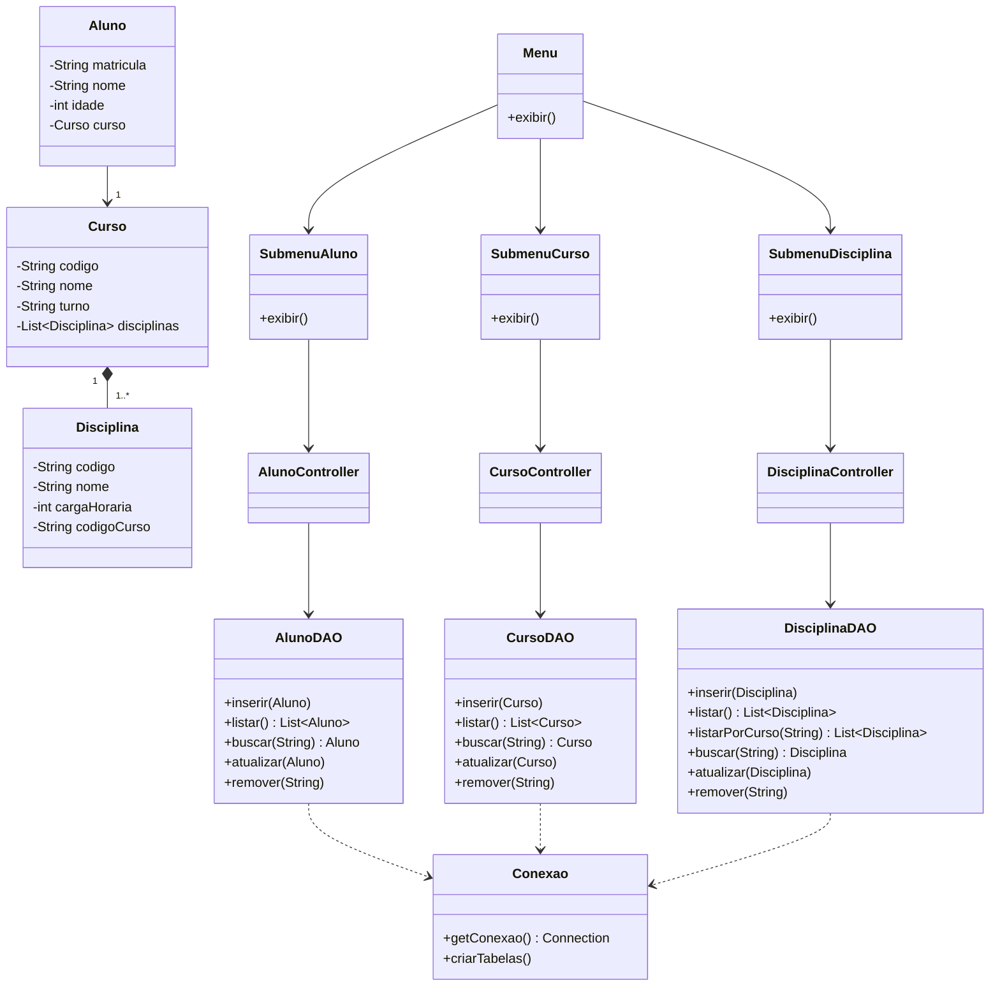

# Diagrama de Classes

```mermaid
classDiagram
    class Aluno {
        -String matricula
        -String nome
        -int idade
        -Curso curso
    }
    class Curso {
        -String codigo
        -String nome
        -String turno
        -List~Disciplina~ disciplinas
    }
    class Disciplina {
        -String codigo
        -String nome
        -int cargaHoraria
        -String codigoCurso
    }
    class Conexao {
        +getConexao() Connection
        +criarTabelas()
    }
    class AlunoDAO {
        +inserir(Aluno)
        +listar() List~Aluno~
        +buscar(String) Aluno
        +atualizar(Aluno)
        +remover(String)
    }
    class CursoDAO {
        +inserir(Curso)
        +listar() List~Curso~
        +buscar(String) Curso
        +atualizar(Curso)
        +remover(String)
    }
    class DisciplinaDAO {
        +inserir(Disciplina)
        +listar() List~Disciplina~
        +listarPorCurso(String) List~Disciplina~
        +buscar(String) Disciplina
        +atualizar(Disciplina)
        +remover(String)
    }
    class AlunoController
    class CursoController
    class DisciplinaController
    class Menu {
        +exibir()
    }
    class SubmenuAluno {
        +exibir()
    }
    class SubmenuCurso {
        +exibir()
    }
    class SubmenuDisciplina {
        +exibir()
    }

    Aluno --> "1" Curso
    Curso "1" *-- "1..*" Disciplina
    Menu --> SubmenuAluno
    Menu --> SubmenuCurso
    Menu --> SubmenuDisciplina
    SubmenuAluno --> AlunoController
    SubmenuCurso --> CursoController
    SubmenuDisciplina --> DisciplinaController
    AlunoController --> AlunoDAO
    CursoController --> CursoDAO
    DisciplinaController --> DisciplinaDAO
    AlunoDAO ..> Conexao
    CursoDAO ..> Conexao
    DisciplinaDAO ..> Conexao
```
